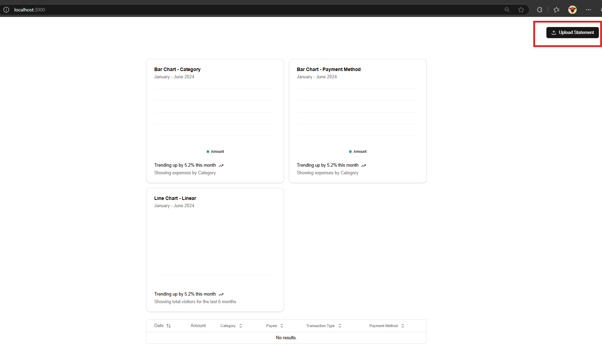
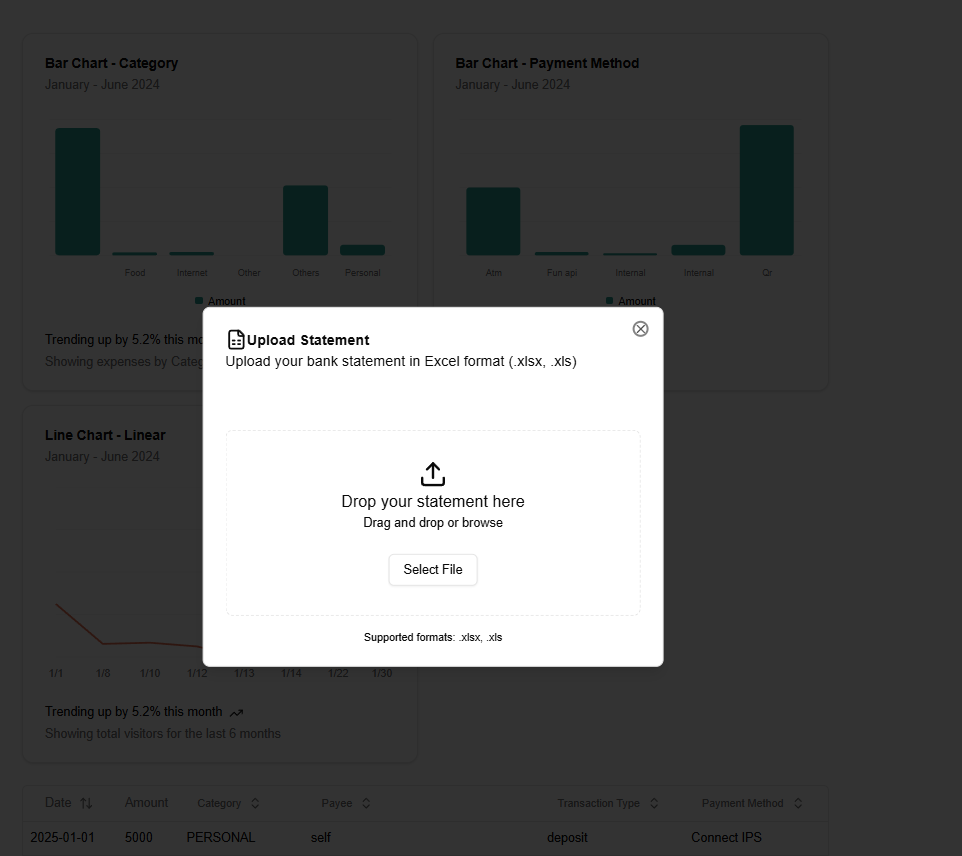

# Statement Analysis
This application helps users analyze and track their expenses by processing bank statements. It provides insights into spending patterns using AI-powered expense categorization and interactive visualizations.

## Key Features

- 📄 Bank Statement Processing: Upload statements for automatic transaction analysis.
- 🤖 AI-Powered Categorization: Uses OpenAI’s API to classify expenses, detect payment methods, and identify recipients/sources.
- 📊 Expense Insights & Forecasting:
    - Bar charts for expense categories and payment methods.
    - Line charts for daily expenditure trends.
- ⚡ FastAPI Backend: Provides APIs to fetch categorized transactions and spending insights.
- 🎨 Next.js Frontend: Displays charts and tables using Recharts and Tailwind styling.

## Run the application
Make sure you have docker and docker compose installed if you want to run the application using docker

### Run frontend 
Go to the frontend directory

```
cd statement-analysis-fe
```
Then run the docker compose command
```
docker componse up --build -d
```

Access the application at http://localhost:3000

### Run Backend
Go the the backend directory

```
cd statement-analysis-be
```
Create and update the `.env` in the `statement-analysis-be` folder

.env
```
OPENAI_API_KEY=YOUR_OPENAI_API_KEY
REDIS_URL=redis://redis:6379/0
DATABASE_HOST=postgres
DATABASE_USER=postgres
DATABASE_NAME=statement-analysis
DATABASE_PASSWORD=password
```

Then run the docker compose command
```
docker compose up --build -d
```

Server will run on the following URL http://localhost:8001

Access the available APIs from http://localhost:8001/docs

### How to use
Download the bank statement from your mobile banking applicaition. 

Go the the URL http://localhost:3000

Upload your statement by clicking the `Upload Statement` Button



Here you can Select the excel file or drag and drop the statement.




After selecting the file and uploadig it it takes some time to display the charts and table, refresh the page after some time to see the updated charts and graphs
